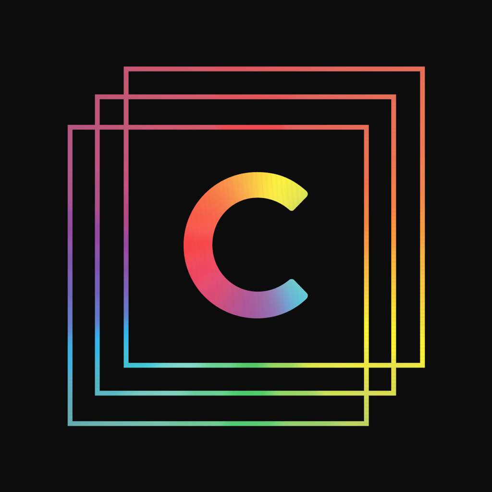

# Android Engineer

#### Must haves:
- strong **Java** skills
- experience with **OpenGL**
- experience with Gradle
- past experience developing and maintaining live Android apps
- experience with Testflight
- experience with Google Play Store
- experience with Git & Github

#### Nice to haves:
- online portfolio website of past apps
- experience with Kotlin
- experience working with a distributed team

We are a **remote first** company, so we will be accepting applications from all over the world.

Our timezone is Australian Eastern Standard Time (AEST), so if you apply, please ensure this timezone will suit your working hours.

